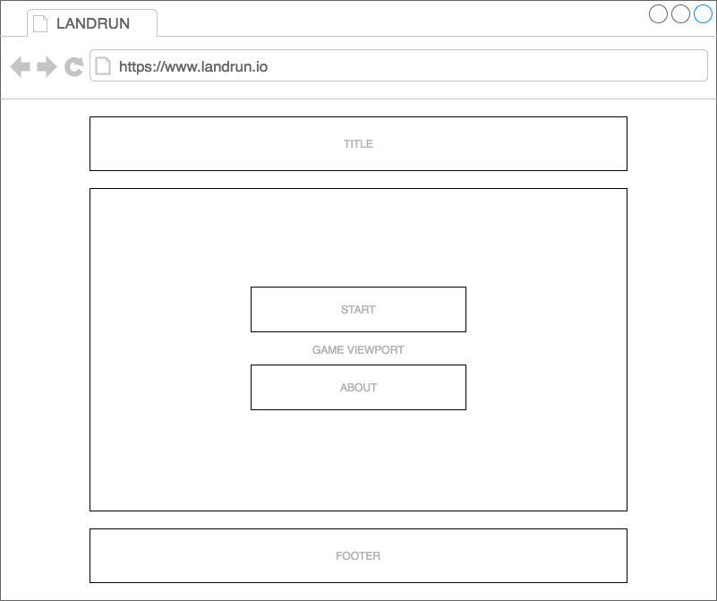

## Background

LANDRUN is a game where the goal is to claim as much area of the game board as possible.

* The game is based on the following concepts:
* The player can move in 4 directions - up, right, down, left.
* The player begins with a 3x3 area of claimed board.
* The player is always moving and leaves a tail behind them.
* If the return to their original territory, the area enclosed by their tail is captured.
* If the player or another player collides with the player's tail before returning to their territory, the player is eliminated and loses all territory.

There are multiple ways to incorporate other players, this is outlined in Functionality & MVP and Bonus Features sections.

## Functionality & MVP

With LANDRUN, users will be able to:
- [ ] Start a new game.
- [ ] Move around the game board leaving a tail.
- [ ] Connect back to their territory to capture more territory.
- [ ] Be eliminated if their tail is crossed before returning.
- [ ] Face off against simple AI controlled enemies.

In addition to the basic gameplay features:
- [ ] A background modal to outline the game concepts and rules.
- [ ] A production README.

## Wireframes

This game will utilize a single page containing the game board. Upon arrival the user will be presented with two options: Start and About.

Clicking Start will immediately begin a new game. Clicking About will load a modal displaying game concepts and rules.

## Architecture and Technologies

* `JavaScript` for game logic.
* `Canvas API` for game drawing.
* `webpack` to bundle JavaScript files.

In addition to the entry file, there will be

`game.js`: This script will handle the tick processing, movement, and track the global state of the application. This will also track for tail collisions that eliminate players.

`view.js`: This script will handle drawing the view the current player can see from their location.

`player.js`: This script will handle the player movement logic, as well as their tail.

`land.js`: This script will handle the drawing and expansion / removal of territory as necessary after each tick.

## Implementation Timeline

**Day 1**:
* Set up game environment with variables for controlling time / player movespeed / viewport tracking.
* Create necessary scripts to start new game.
* Set up game ticks.

**Day 2**:
* Implement player movement
* Implement player tail
* Implement player claiming territory.

**Day 3**:
* Create necessary scripts for utilizing the player specific viewport.
* Implement necessary tracking for tail collisions resulting in player elimination.
* Set up light-weight AI that randomly moves about the board.

## Bonus Features

There are additional features worth considering to enhance the gameplay:
- [ ] Scoring and score tracking.
- [ ] More natural AI that varies in it's goal (offensive / defensive).
- [ ] Online multiplayer.
- [ ] Consider boosts / power ups to provide more dynamic strategy.
